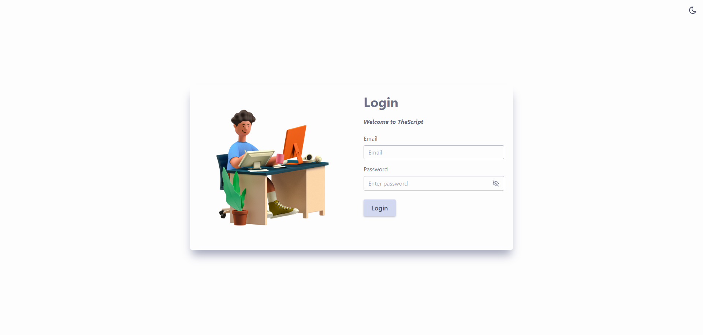
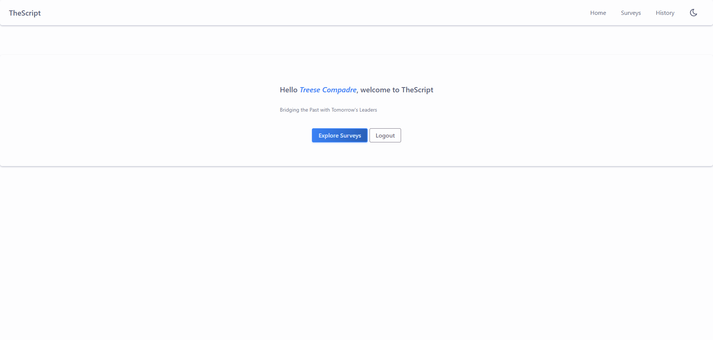
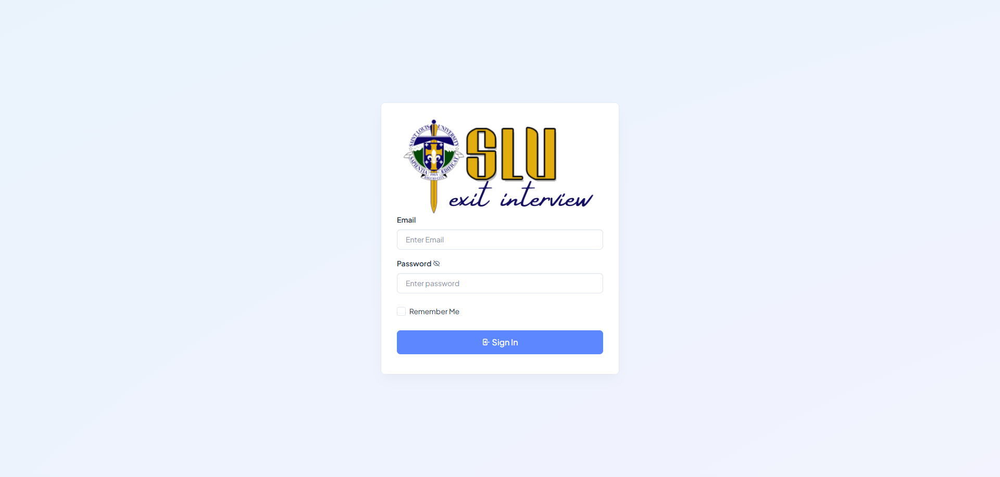
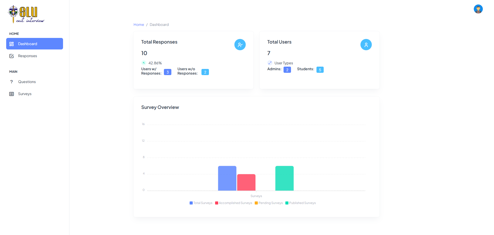

# Exit Survey Program

## About the Project
The Exit Survey Program is a web-based application designed to collect feedback from graduating students through a structured questionnaire. The primary goal is to assess the achievement of program learning outcomes and gather insights for continuous improvement. The system consists of two main modules: the Student module, where graduates can complete the survey, and the Admin module, where administrators can manage and analyze responses.

## Technologies Used
- **Admin Side**: Built using PHP and Bootstrap for the interface.
- **Student Side**: Developed with Node.js and Tailwind CSS, utilizing the [FlyonUI](https://flyonui.com/) component library.

## Features

### Student Module
- Log in to the system
- Answer the exit survey questions and submit responses
- View information about the completed response

### Admin Module
- Create and update a pool of survey questions, organized by category
- Set and manage questionnaires for specific evaluation periods (e.g., 1st Sem AY 2023-2024)
- Edit the questionnaire before publishing (add, modify, or remove questions)
- Publish the questionnaire for students
- Associate questionnaires with specific programs
- Restrict questionnaire access to specific student groups or classes
- View system-generated information with the following functionalities:
    - Search and filter options (e.g., by academic year, curriculum, category)
    - Relevant visualizations for easier understanding of survey results
    - Confidentiality measures to protect student identities while maintaining data integrity
    - Information on survey respondents and non-respondents

## Database Setup
Ensure the provided SQL file is imported into MySQL before running the application. You can do this by logging into MySQL and running:

```sql
mysql -u root -p
CREATE DATABASE exit_survey;
USE exit_survey;
SOURCE path/to/exit_survey.sql;

```
## Running the Application

### Student Side
To start the student-side application, navigate to the student directory and run:
```
cd student
npm start
```
The student interface will be available at http://localhost:5000/.

### Admin Side
To start the admin-side application, navigate to the admin directory and run:
```
cd admin
php -S localhost:5050
```
The admin panel will be accessible at http://localhost:5050/.

## Program Snapshots
Below are snapshots of the Exit Survey Program showcasing the Student and Admin modules:

**Student Login Page**


**Student Home Page**


**Admin Login Page**


**Admin Home Page**


## Contributors
The following individuals contributed to the development of the Exit Survey Program:

- **[Matt Danielle Bravo](https://www.linkedin.com/in/matt-danielle-bravo-b68372284/)**
- **[Neil Angelo Briones](https://www.linkedin.com/in/neil-briones/)**
- **[Rouxvick Dictag](https://www.linkedin.com/in/rouxvick-dictag-79b6bb346/)**
- **Milton Junsel Fabe**
- **[Anthony Llena](https://www.linkedin.com/in/anthony-llena-031026182/)**
- **[Hans Elijah Viduya](https://www.linkedin.com/in/hanselijahv/)** 


